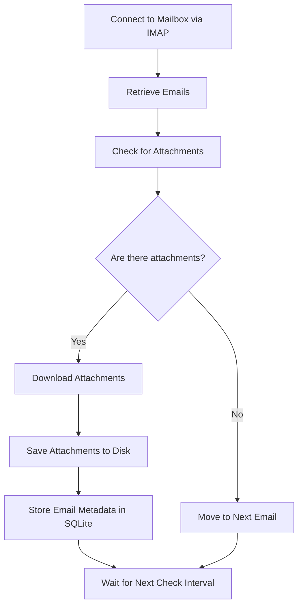

# AttachHound

**AttachHound** is a lightweight, easy-to-use Python application designed to streamline the collection of email attachments. It connects to your mailbox using IMAP, retrieves emails, downloads their attachments, and stores the email metadata (like subject, sender, date, and attachment details) in an SQLite database. AttachHound is perfect for automating tasks that require tracking and managing email attachments.

---

### 🚀 **Key Features**:
- 📥 **Automated Attachment Collection**: Connects to your mailbox and fetches attachments on a recurring schedule.
- 💾 **Metadata Storage**: Saves email metadata to an SQLite database for easy reference and auditing.
- ⚙️ **Customizable**: Easily configurable with environment variables or command-line arguments.
- 🛡️ **Safety First**: Filenames are automatically sanitized to ensure safe storage.

---

## 🛠️ **How It Works**


---

## 📦 **Running the App**

### **Option 1: Use Prebuilt Docker Image**
You can run AttachHound using a prebuilt Docker image from the GitHub Container Registry:
```bash
docker run -d --env-file .env ghcr.io/stalbrec/attachhound:<tag>
```

Available tags:
| **Tag**       | **Description**                 |
|---------------|---------------------------------|
| `main-amd64`  | Main branch for amd64 architecture |
| `main-arm64`  | Main branch for arm64 architecture |

### **Option 2: Build the Image Yourself**
Alternatively, you can build the Docker image from source:
```bash
git clone https://github.com/stalbrec/attachhound.git && cd attachhound
docker build -t attachhound .
docker run -d --env-file .env attachhound
```

---

## ⚙️ **Environment Variables**

To configure AttachHound, create a `.env` file with the following content:

```bash
MAIL_SERVER=imap.gmail.com       # (default) or any other mail server
MAIL_PORT=993                    # (default) or any other port
EMAIL_ADDRESS=<your e-mail address>
EMAIL_PASSWORD=<your e-mail password>
CHECK_INTERVAL=60                # in seconds
```

---

With this setup, AttachHound will periodically check your email, download attachments, and store all relevant metadata for future use. It's an ideal solution for anyone looking to automate their email workflows.

---